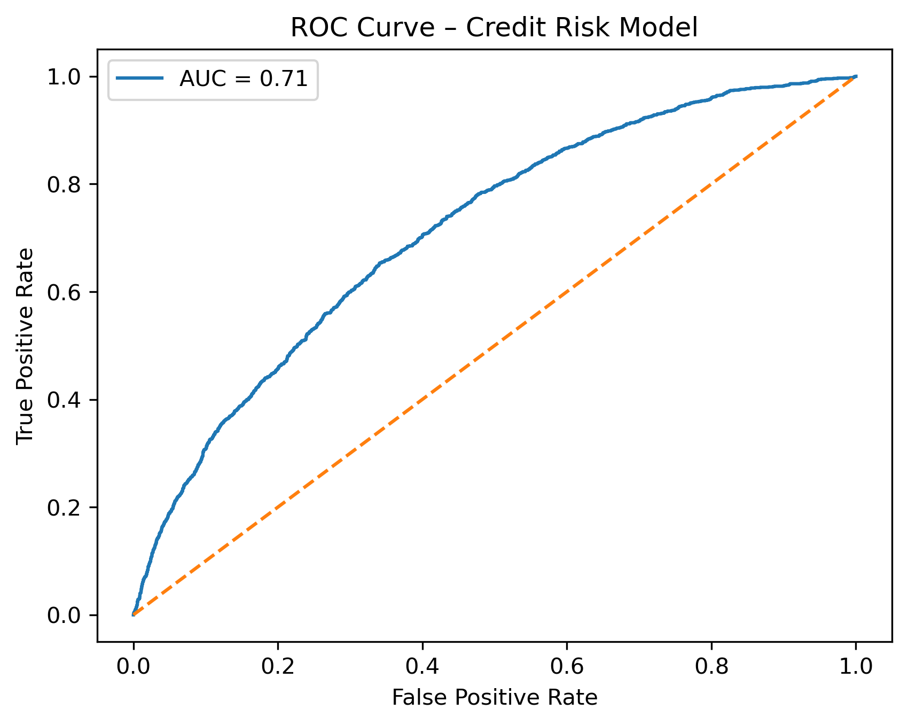

# Credit Risk Analysis & Default Prediction


## 📌 Project Overview

This project analyzes peer-to-peer lending data from Lending Club to identify key drivers of loan default and build a predictive credit risk model using logistic regression.

The goal is to demonstrate **end-to-end data analytics skills**, including data cleaning, exploratory analysis, statistical modeling, and business interpretation.

---

## 🎯 Business Objective

- Predict loan default probability  
- Identify borrower and loan characteristics associated with higher credit risk  
- Support data-driven lending decisions

---

## 📊 Dataset

- **Source:** Lending Club (2007–2020)
- **Observations:** 50,000 (sampled for reproducibility)
- **Target variable:** `default` (1 = default, 0 = non-default)

### Key Features
- Loan amount
- Interest rate
- Debt-to-income ratio (DTI)
- Employment length
- Credit score (FICO)
- Loan term

⚠️ **Note:**  
The full dataset is not included due to size. A representative sample is used.

---

## 🛠️ Tools & Technologies

- Python
- Pandas, NumPy
- Matplotlib
- Scikit-learn
- Jupyter Notebook

---

## 🔍 Exploratory Data Analysis (EDA)

Key findings from EDA:

- Default rate ≈ **19.7%**
- Higher interest rates and longer loan terms are associated with higher default risk
- Lower FICO scores correspond to increased probability of default
- Higher DTI shows a moderate positive relationship with default

---

## 🤖 Model: Logistic Regression

- Features were standardized
- Train/test split applied
- Evaluation metric: **ROC-AUC**

### Model Performance
- **ROC-AUC:** ~ **0.71**



---

## 📈 Model Interpretation

Top predictors of default:

| Feature | Impact on Default Risk |
|------|------------------------|
| Interest Rate | Strong positive |
| Loan Term | Moderate positive |
| Debt-to-Income | Positive |
| FICO Score | Negative (protective) |

**Interpretation:**  
Borrowers with higher interest rates, longer loan terms, higher DTI, and lower credit scores are more likely to default.

---

## 📂 Repository Structure

```text
credit-risk-analysis/
├── data/
│   └── loan_data.csv
├── notebooks/
│   └── 01_credit_risk.ipynb
├── images/
│   └── roc_curve.png
├── README.md

---

🚀 Next Improvements

Try tree-based models (Random Forest, XGBoost)

Perform hyperparameter tuning

Add probability calibration

Business cost-sensitive modeling

👤 Author

Fikreyohannes Getnet Anlay
MSc Data Analytics – Georgia Institute of Technology
Background in Banking & Development Economics

🔗 GitHub: https://github.com/fikre-anlay
