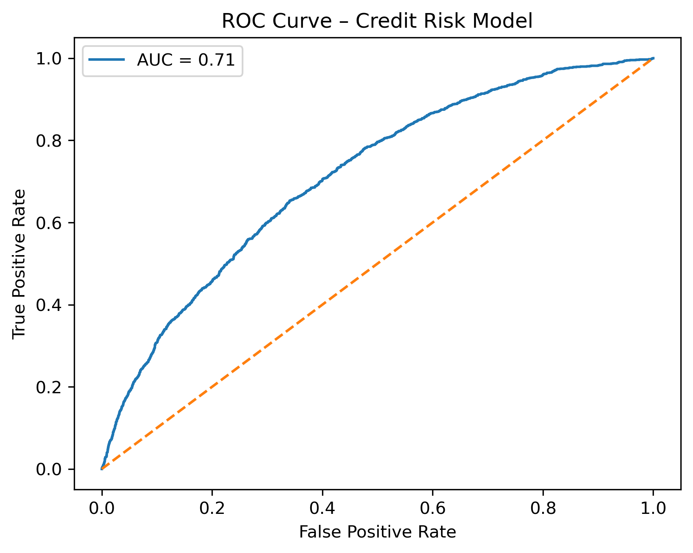

# Credit Risk Analysis & Default Prediction

## AI-Powered Credit Risk Assistant

This project started as a credit risk analysis notebook and has been upgraded into a Streamlit web application called **AI-Powered Credit Risk Assistant**.

The original analysis is still the foundation of the project. The app makes the workflow easier to use by letting someone upload loan data, train or load a logistic regression model, predict default risk, and read simple explanations for the predictions.

## Business Problem

Financial institutions need to identify high-risk borrowers to reduce loan default losses.

## Data

This project uses publicly available Lending Club accepted loan data (2007-2018), including loan amount, interest rate, income, debt-to-income ratio, employment length, and credit score.

Due to file size constraints, a representative sample of the dataset is included in this repository.

## Methodology

- Data cleaning and preprocessing
- Exploratory data analysis (EDA)
- Logistic regression modeling
- Model evaluation using AUC and ROC curve

## Results

The logistic regression model achieved an AUC of 0.71, indicating good ability to distinguish between defaulted and non-defaulted loans.

## Key Insights

- Higher interest rates, longer loan terms, and higher debt-to-income ratios increase default risk
- Higher credit scores reduce default probability
- The model is useful as an interpretable baseline because the coefficients are easy to connect back to business reasoning

## Business Value

This analysis can support credit decision-making by improving loan approval and pricing strategies.

The Streamlit app adds a practical interface on top of the notebook so the model can be tested with new CSV files and reviewed without changing notebook code.

## Streamlit App

The new app is built with Streamlit and uses the same modeling idea from the original notebook. It allows users to:

- Upload a CSV file
- Preview the uploaded data
- Review missing values
- Train a logistic regression model
- Load a saved model from the `model/` folder
- Predict loan default risk probabilities
- Categorize applicants as Low Risk, Medium Risk, or High Risk
- View ROC curve, risk distribution, and feature importance charts
- Read simple plain-English risk explanations
- Download predictions as a CSV file

## AI-Powered Features

- **Default risk scoring:** Predicts the probability that a loan applicant may default
- **Risk categories:** Converts predicted probabilities into Low Risk, Medium Risk, and High Risk groups
- **Plain-English explanations:** Summarizes the main factors behind each prediction using interest rate, DTI, FICO score, term, income, and employment length
- **Interactive dashboard:** Lets users train, load, evaluate, and use the model without editing notebook code
- **Notebook-to-app workflow:** Keeps the original analysis while adding a small web app layer

## Project Structure

```text
credit-risk-project/
├── .gitignore
├── app.py
├── requirements.txt
├── README.md
├── data/
│   └── loan_data.csv
├── images/
│   └── roc_curve.png
├── model/
│   └── .gitkeep
└── notebooks/
    └── 01_credit_risk.ipynb
```

When a model is saved from the app, it is stored as:

```text
model/credit_risk_model.pkl
```

## How to Run the App Locally

1. Clone or download this project.

2. Open a terminal in the project folder.

```bash
cd credit-risk-project
```

3. Create and activate a virtual environment.

```bash
python -m venv .venv
source .venv/bin/activate
```

On Windows:

```bash
.venv\Scripts\activate
```

4. Install the required packages.

```bash
pip install -r requirements.txt
```

5. Run the Streamlit app.

```bash
streamlit run app.py
```

6. Open the local Streamlit URL shown in the terminal, usually:

```text
http://localhost:8501
```

## How to Use the App

1. Start the app with `streamlit run app.py`.
2. Use the included sample dataset or upload your own CSV file.
3. Choose whether to train a model or load an existing saved model.
4. Review the data preview and missing value summary.
5. View the model AUC, ROC curve, and feature importance chart.
6. Review predicted default probabilities and risk categories.
7. Download the prediction results as a CSV file.

## Screenshots

Add screenshots of the Streamlit dashboard here after running the app.

Suggested screenshots:

- Data upload and preview
- ROC curve and AUC score
- Risk distribution charts
- Prediction table with plain-English explanations

Existing ROC curve from the original notebook:



## Model Features

The model uses the main features from the original credit risk workflow:

- `loan_amnt`
- `int_rate`
- `annual_inc`
- `dti`
- `fico_range_low`
- `emp_length`
- `term`

The app can train from a dataset that includes either `loan_status` or a binary `default` column.

## Modeling Approach

The application uses logistic regression because it is:

- Easy to understand
- Fast to train
- Suitable for binary classification
- Interpretable through model coefficients
- Beginner-friendly and appropriate for a portfolio-ready baseline credit risk model

The app uses a simple preprocessing workflow:

- Converts loan term values such as `36 months` into numeric values
- Converts employment length values such as `10+ years` into numeric values
- Keeps the same core features used in the original notebook
- Fills missing numeric values with the training median
- Standardizes features before logistic regression

## Resume-Ready Project Description

Built a credit risk prediction app using Python, Streamlit, Pandas, NumPy, Matplotlib, and Scikit-learn. The app allows users to upload loan data, train or load a logistic regression model, predict default probabilities, classify applicants into risk categories, visualize ROC-AUC and feature importance, and generate plain-English risk explanations. The project extends an existing notebook-based credit risk analysis into an interactive web application.

## Future Improvements

- Add more advanced models such as Random Forest, XGBoost, or LightGBM
- Add model comparison across multiple algorithms
- Include SHAP values for stronger individual prediction explanations
- Add fairness and bias checks across borrower groups
- Add threshold tuning based on business cost of false positives and false negatives
- Add database storage for uploaded applicants and prediction history
- Deploy the app on Streamlit Community Cloud, Render, or Hugging Face Spaces
- Add authentication for internal credit analyst workflows

## Disclaimer

This project is for educational and portfolio purposes. It should not be used as the sole basis for real lending decisions without additional validation, monitoring, compliance review, and fairness testing.
