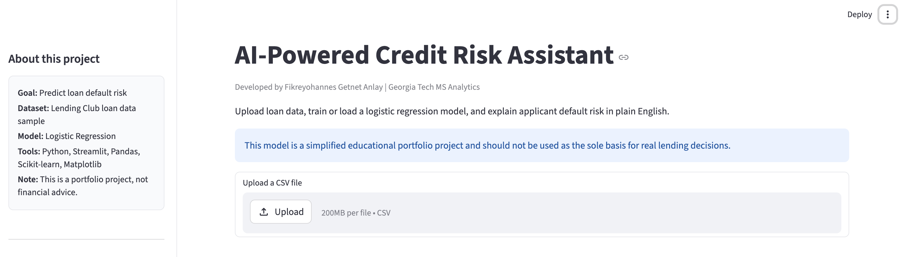
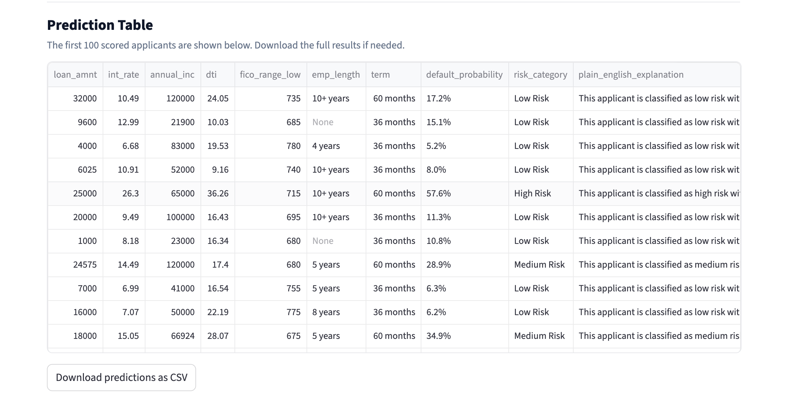
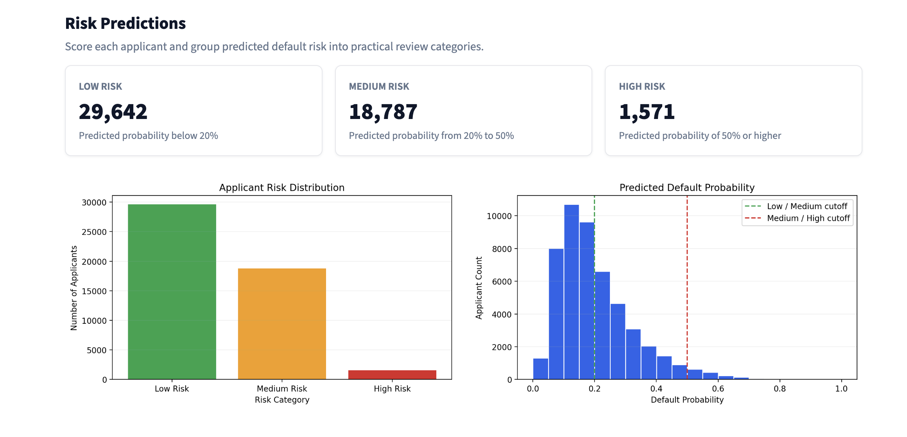
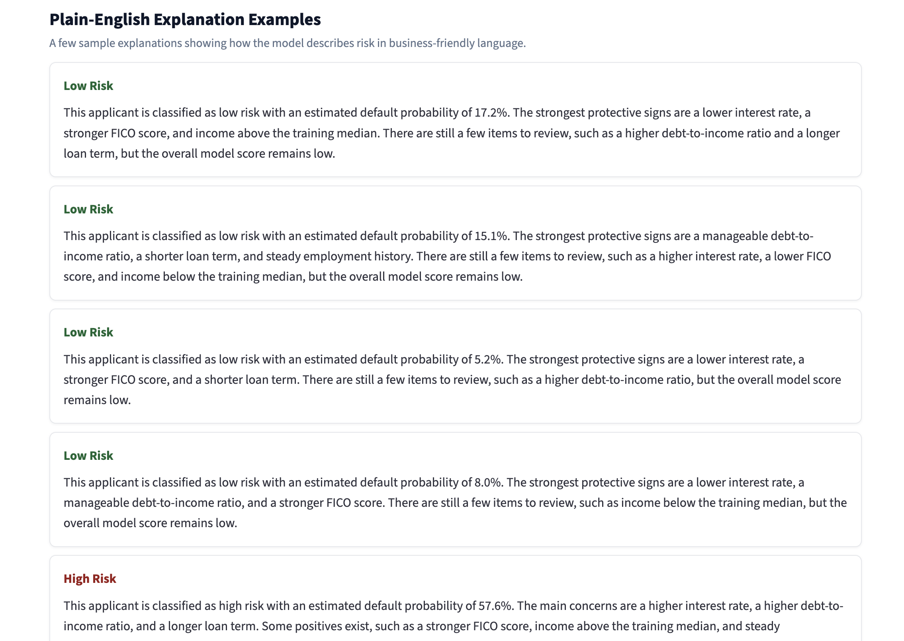

# AI-Powered Credit Risk Assistant

This project started as a credit risk analysis notebook and has been upgraded into a Streamlit web application called **AI-Powered Credit Risk Assistant**.

The original analysis is still the foundation of the project. The app makes the workflow easier to use by letting someone upload loan data, train or load a logistic regression model, predict default risk, and read simple explanations for the predictions.

Developed by **Fikreyohannes Getnet Anlay**  
Georgia Tech MS Analytics

---

## Business Problem

Financial institutions need to identify high-risk borrowers to reduce loan default losses.

---

## Data

This project uses publicly available Lending Club accepted loan data (2007-2018), including loan amount, interest rate, income, debt-to-income ratio, employment length, and credit score.

Due to file size constraints, a representative sample of the dataset is included in this repository.

---

## Methodology

- Data cleaning and preprocessing
- Exploratory data analysis (EDA)
- Logistic regression modeling
- Model evaluation using AUC and ROC curve

---

## Results

The logistic regression model achieved an AUC of 0.71, indicating good ability to distinguish between defaulted and non-defaulted loans.

---

## Key Insights

- Higher interest rates, longer loan terms, and higher debt-to-income ratios increase default risk
- Higher credit scores reduce default probability
- The model is useful as an interpretable baseline because the coefficients are easy to connect back to business reasoning

---

## Business Value

This analysis can support credit decision-making by improving loan approval and pricing strategies.

The Streamlit app adds a practical interface on top of the notebook so the model can be tested with new CSV files and reviewed without changing notebook code.

---

## Streamlit App

The app is built with Streamlit and uses the same modeling workflow from the original notebook. It allows users to:

- Upload a CSV file
- Preview uploaded loan data
- Review missing values
- Train a logistic regression model
- Load a saved model from the `model/` folder
- Predict loan default probabilities
- Categorize applicants into Low Risk, Medium Risk, and High Risk groups
- View ROC curve, risk distribution, and feature importance charts
- Read plain-English risk explanations
- Download prediction results as a CSV file

---

## AI-Powered Features

- **Default risk scoring:** Predicts the probability that a loan applicant may default
- **Risk categories:** Converts probabilities into Low Risk, Medium Risk, and High Risk groups
- **Plain-English explanations:** Summarizes the main factors behind each prediction using interest rate, DTI, FICO score, term, income, and employment length
- **Interactive dashboard:** Allows users to train, load, evaluate, and use the model without editing notebook code
- **Notebook-to-app workflow:** Extends the original notebook into an interactive application

---

## Dashboard Preview

### Homepage


### Risk Prediction Dashboard


### Visual Analytics


### Plain-English Explanations


### ROC Curve


---

## Project Structure

```text
credit-risk-project/
├── .gitignore
├── app.py
├── requirements.txt
├── README.md
├── images/
│   ├── homepage.png
│   ├── predictions.png
│   ├── charts.png
│   ├── explanations.png
│   └── roc_curve.png
├── model/
│   └── .gitkeep
└── notebooks/
    └── 01_credit_risk.ipynb
```

When a model is saved from the app, it is stored locally as:

```text
model/credit_risk_model.pkl
```

---

## How to Run the App Locally

### 1. Clone or download this repository

```bash
git clone https://github.com/fikre-anlay/credit-risk-analysis.git
```

### 2. Open the project folder

```bash
cd credit-risk-analysis
```

### 3. Create and activate a virtual environment

Mac/Linux:

```bash
python3 -m venv .venv
source .venv/bin/activate
```

Windows:

```bash
.venv\Scripts\activate
```

### 4. Install required packages

```bash
pip install -r requirements.txt
```

### 5. Run the Streamlit app

```bash
streamlit run app.py
```

### 6. Open the local Streamlit URL

Usually:

```text
http://localhost:8501
```

---

## How to Use the App

1. Start the app with `streamlit run app.py`
2. Upload a CSV dataset or use the included sample dataset
3. Train a new model or load an existing saved model
4. Review the data preview and missing value summary
5. View the model AUC, ROC curve, and feature importance chart
6. Review predicted default probabilities and risk categories
7. Download prediction results as a CSV file

---

## Model Features

The model uses the main features from the original credit risk workflow:

- `loan_amnt`
- `int_rate`
- `annual_inc`
- `dti`
- `fico_range_low`
- `emp_length`
- `term`

The app can train from a dataset that includes either `loan_status` or a binary `default` column.

---

## Modeling Approach

The application uses logistic regression because it is:

- Easy to understand
- Fast to train
- Suitable for binary classification
- Interpretable through model coefficients
- Beginner-friendly and appropriate for a portfolio-ready baseline model

The preprocessing workflow:

- Converts loan term values such as `36 months` into numeric values
- Converts employment length values such as `10+ years` into numeric values
- Keeps the same core features used in the original notebook
- Fills missing numeric values with the training median
- Standardizes features before logistic regression

---

## Resume-Ready Project Description

Built an AI-powered credit risk prediction app using Python, Streamlit, Pandas, NumPy, Matplotlib, and Scikit-learn. The application allows users to upload loan data, train or load a logistic regression model, predict default probabilities, classify applicants into risk categories, visualize ROC-AUC and feature importance, and generate plain-English risk explanations. The project extends an existing notebook-based credit risk analysis into an interactive web application.

---

## Future Improvements

- Add more advanced models such as Random Forest, XGBoost, or LightGBM
- Add model comparison across multiple algorithms
- Include SHAP values for stronger individual prediction explanations
- Add fairness and bias checks across borrower groups
- Add threshold tuning based on business costs
- Add database storage for uploaded applicants and prediction history
- Deploy the app on Streamlit Community Cloud or Render
- Add authentication for internal analyst workflows

---

## Disclaimer

This project is for educational and portfolio purposes. It should not be used as the sole basis for real lending decisions without additional validation, monitoring, compliance review, and fairness testing.
